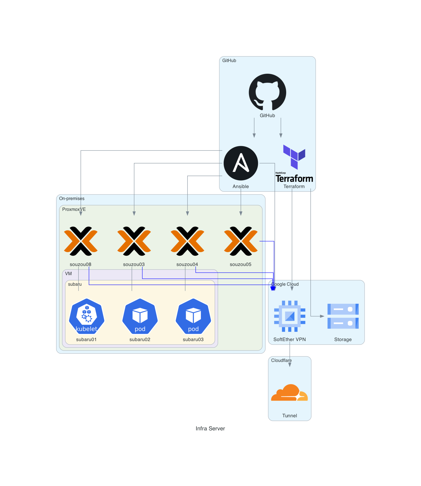
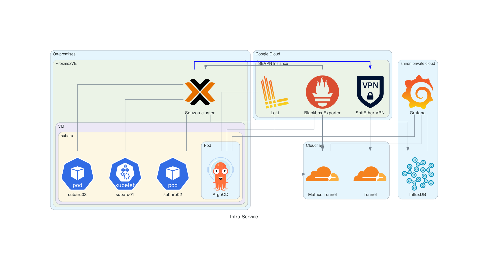

# システム構成

- サーバー構成
  - クラウド
  - VM 構成

## サービス概要

本システムには、オンプレとクラウドの環境が存在しています。オンプレでは、Proxmox による仮想化環境を構築しており、クラウドでは GCP を利用しています。基本的な計算リソースはオンプレに存在しており、クラウドはエンドポイントやゲートウェイとして存在しています。

BeLifelineは複数のサービスに分かれており、

- Kiuzna (バックエンドAPI)
  - バックエンドAPI
  - データの変換、保存、管理を行う
  - onp-k8s にデプロイ
  - Love (バックエンド外部情報バッチサービス)
    - 外部情報の更新をフックするためのバッチサービス
    - 外部情報の取得は行わない(Kizunaが行う)
    - onp-k8s の CronJob で定期実行
- Koyo (アルゴリズムクラスター)
  - 外部情報からデータを処理して、Kizunaにデータを提供する
  - 複数種のアルゴリズムがクラスターで動作
  - Kizuna からの k8s control に対するリクエストで動作する
  - onp-k8s にデプロイ
- Polka (フロントエンド-ビジュアライザー)
  - APIのビジュアライザーやプレイグラウンドとして動作するフロントエンドのサービス
  - Cloudflare Pages でホスティング
  - KizunaのAPIを叩くだけのシンプルなビジュアライザーで専用APIは存在しない

## インフラ構成

### サーバー構成

クラウドの構成は[belifeline-infra](https://github.com/halcyon-org/belifeline-infra)にて
Terraform で管理されています。

### サービス構成

サービス構成は以下の通りです。

