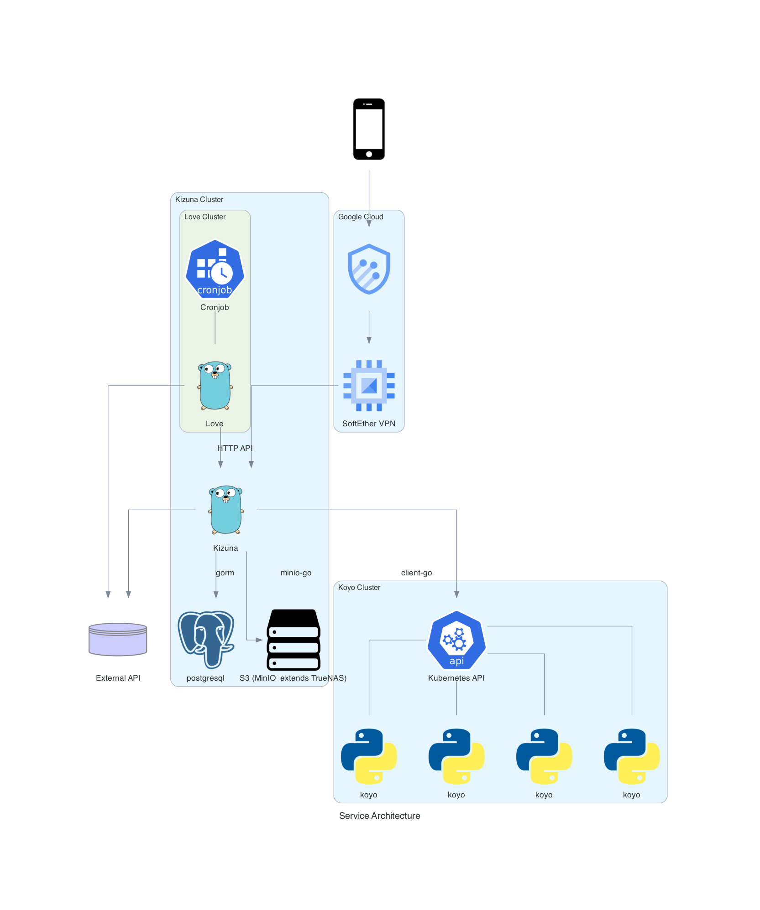

# システム構成

## 概要

- クラウドは GCP を使用
- 基本的にすべてサーバレス設計

### 構成図の説明

- Client
  - Client(Remix)
    - Remix を用いて Web アプリケーションを作成する
    - 何かしらの Map API の地図上に Backend API から取得したヒートマップをオーバーレイする
    - Cloudflare Pages でホスティングする
- GCP
  - Armor
    - DDoS や Bot の対策のための GCP と外を繋ぐゲートウェイとする
    - inbound は Armor を通し、outbound は Armor を通さないようにする(通信量削減)
  - Backend API
    - Main と Algorithm の二系統存在し、Algorithm 系は GCP 内のみアクセスできる
    - Main は外部からアクセス可能(Client のための API を提供する)
    - Algorithm API は Algorithm Cluster の制御を行う
  - Backend DB
    - 暫定的に PostgreSQL を使用
    - ヒートマップを PostGIS みたいなのを使うか、別の DB(Big Query 等)に保存するかは検討中
  - Backend Storage
    - 衛星画像などの一時保存を行う
- Algorithm Cluster

### システム構成図

