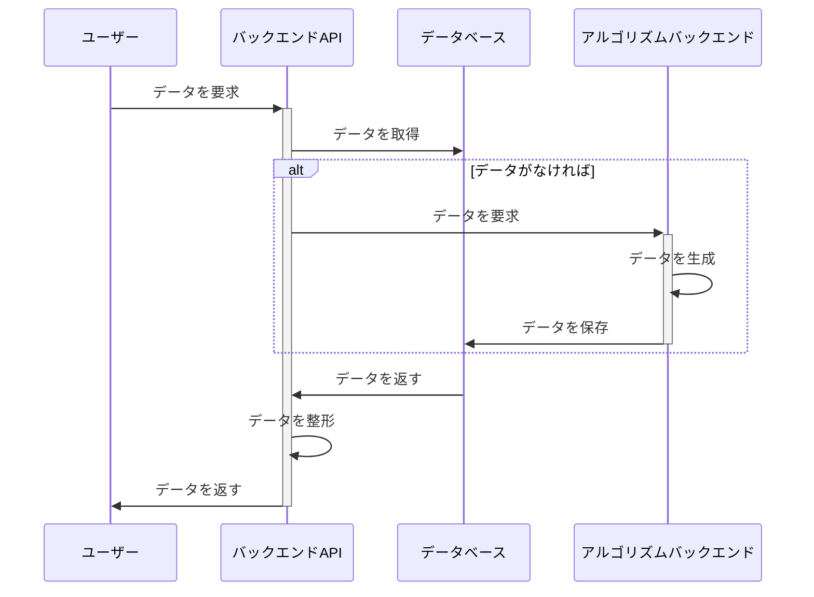

# プロバイダーシーケンス図

## データ取得

```mermaid
sequenceDiagram
    participant user as ユーザー
    participant koyo as バックエンドAPI
    participant db as データベース
    participant koyo_server as アルゴリズムバックエンド
    user ->>+ koyo: データを要求
    koyo ->> db: データを取得
    alt データがなければ
        koyo ->>+ koyo_server: データを要求
        koyo_server ->> koyo_server: データを生成
        koyo_server ->>- db: データを保存
    end
    db ->> koyo: データを返す
    koyo ->> koyo: データを整形
    koyo ->>- user: データを返す

```
