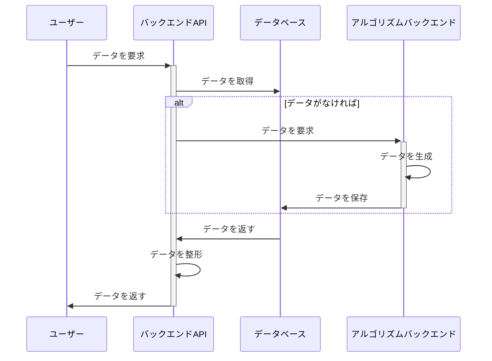

# プロバイダーシーケンス図

## データ取得

```mermaid
sequenceDiagram
    participant user as ユーザー
    participant provider as バックエンドAPI
    participant db as データベース
    participant algorithm_server as アルゴリズムバックエンド
    user ->>+ provider: データを要求
    provider ->> db: データを取得
    alt データがなければ
        provider ->>+ algorithm_server: データを要求
        algorithm_server ->> algorithm_server: データを生成
        algorithm_server ->>- db: データを保存
    end
    db ->> provider: データを返す
    provider ->> provider: データを整形
    provider ->>- user: データを返す

```
