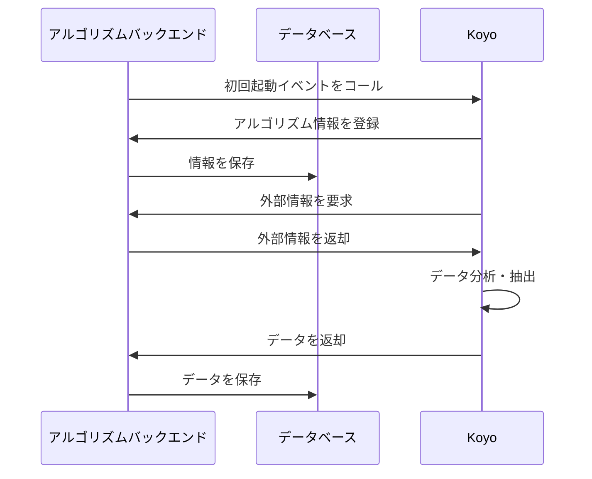
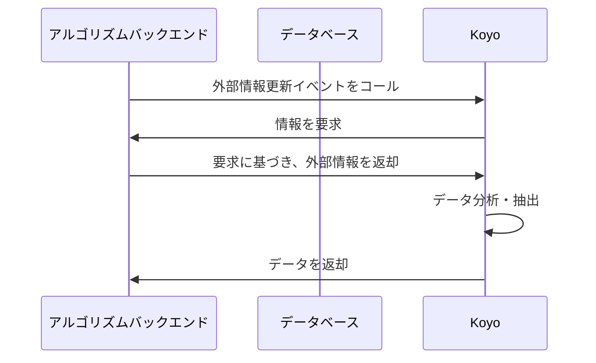

# アルゴリズムクラスターシーケンス図

アルゴリズムクラスター(Koyo)はイベント駆動型である。
イベントは、初回起動時(情報登録)と、外部情報更新時、パラメータ別要求の 3 つがある。

それぞれ、

- 初回起動時
  - Koyo のリリースの際にアルゴリズム情報を登録する
  - その時点の情報でデータを分析する
- 外部情報更新時
  - 外部情報(外部 API 等)が更新された際に、データを更新する
- パラメータ別要求時
  - プロバイダー経由で現在保存されていないデータが要求された際に、データを生成する

## 初回起動時

アルゴリズム情報については、[データの定義#アルゴリズム情報](../data.md#アルゴリズム情報)を参照

## 外部情報更新時・パラメータ別要求時

