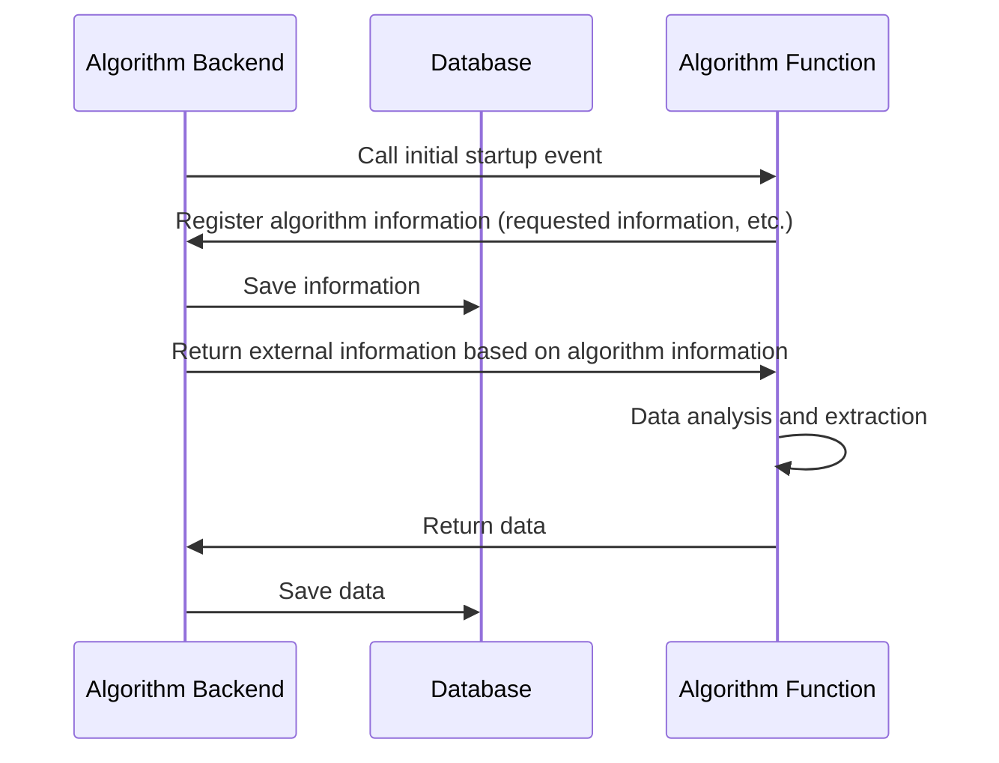
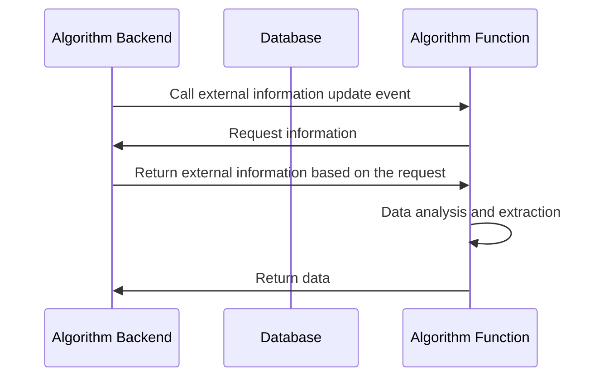
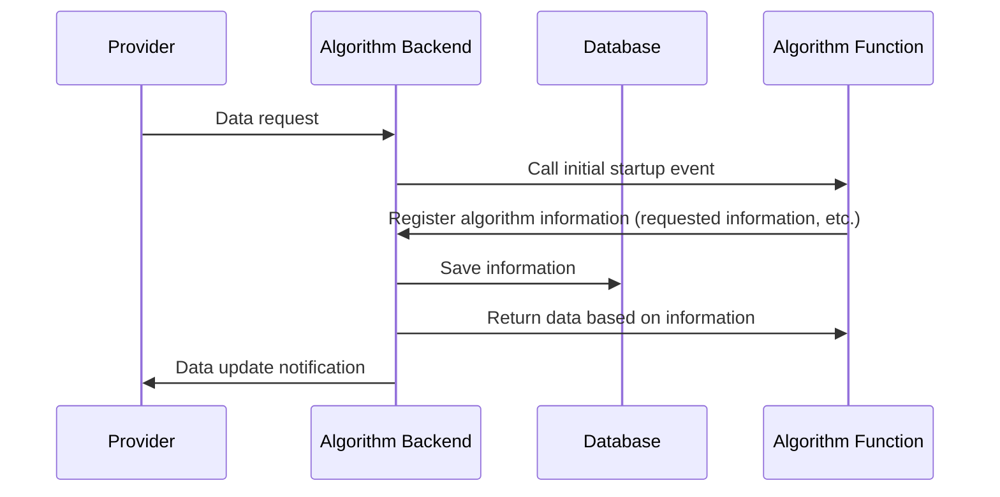

# Algorithm Cluster Sequence Diagram

The Algorithm Cluster (Algorithm function) is event-driven. There are three types of events: initial startup (information registration), external information updates, and parameter-specific requests.

For each event:

- Initial Startup
  - Registers algorithm information upon the release of the Algorithm Function
  - Analyzes data based on the information available at that time
- External Information Update
  - Updates data when external information (such as external APIs) is updated
- Parameter-Specific Request
  - Generates data when data not currently stored is requested through the provider

## Initial Startup

For details on algorithm information, refer to [Data Definition #Algorithm Information](../data.md#アルゴリズム情報)

## External Information Update

## Parameter-Specific Request

