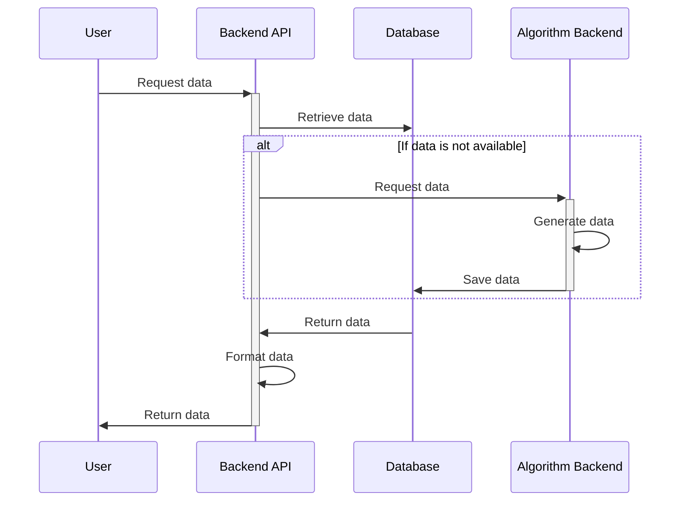

# Provider Sequence Diagram

## Data Retrieval

```mermaid
sequenceDiagram
    participant user as User
    participant provider as Backend API
    participant db as Database
    participant algorithm_server as Algorithm Backend
    user ->>+ provider: Request data
    provider ->> db: Retrieve data
    alt If data is not available
        provider ->>+ algorithm_server: Request data
        algorithm_server ->> algorithm_server: Generate data
        algorithm_server ->>- db: Save data
    end
    db ->> provider: Return data
    provider ->> provider: Format data
    provider ->>- user: Return data
```